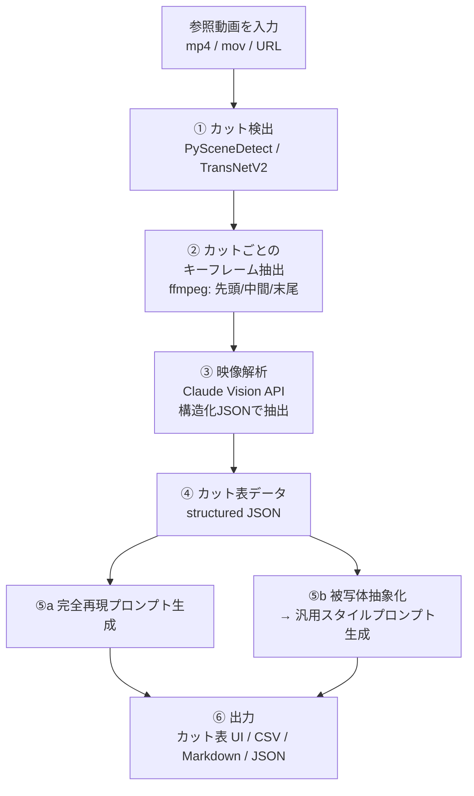

# 参照動画 → カット表 & 再現プロンプト生成ツール 設計書

## 1. コンセプト

参照動画を1本入力するだけで、以下を自動生成するツール。

1. **カット表(Cut Sheet)** — 動画をカット(ショット)単位に分割し、各カットのタイムコード・尺・カメラワーク・構図・照明・被写体・アクションなどの情報を一覧化したもの
2. **完全再現プロンプト** — 各カットの映像を、被写体を含めてそのまま再現するための動画生成AI向けプロンプト
3. **汎用スタイルプロンプト** — 特定の被写体情報を抜き、`{subject}` プレースホルダに置き換えたプロンプト。別の被写体を差し込んでも「同じ雰囲気・同じ撮り方」の映像が生成できる

ユースケース:
- バズった動画の「構成・撮り方」を分解して、自分の商品/人物で同じフォーマットの動画を作る
- 広告・MV・Vlog などのリファレンス動画を、絵コンテ+生成プロンプトのセットに変換する
- 動画生成AI(Veo / Sora / Runway / Kling など)への入力プロンプトを量産する

---

## 2. 全体パイプライン



### ① カット検出(ショット境界検出)
- **PySceneDetect**(ContentDetector)をデフォルトに採用。ヒストグラム差分でカット点を検出。軽量・依存少。
- ディゾルブやフェードが多い映像には **TransNetV2**(学習済みショット境界検出モデル)をオプションで用意。
- 出力: `[{cut_no, start_tc, end_tc, duration_sec}, ...]`

### ② キーフレーム抽出
- 各カットから **先頭・中間・末尾の3フレーム**(長いカットは1秒ごとに追加)を ffmpeg で抽出。
- 複数フレームを渡すことで、静止画1枚では判別できない**カメラの動き(パン/ズーム/ドリー)と被写体のアクション**を解析可能にする。
- サムネイル用に中間フレームを縮小保存。

### ③ 映像解析(ここが核)
- カットごとに複数キーフレームを Claude に渡し、スキーマに沿った構造化データとして解析結果を受け取る。
- 解析の要点: 「フレーム列は同一カットの時系列。フレーム間の差分からカメラの動きと被写体のアクションを推定せよ」を明示する。dolly と zoom の区別など、静止画1枚では原理的に判別できない情報がここで決まる。
- **実行モードは2つあり、現在の実装は (a)**。

  | | (a) Claude Code(実装済み) | (b) Claude API |
  |---|---|---|
  | 費用 | 定額プラン内・追加課金なし | 従量課金(Batches で50%オフ) |
  | 並列処理 | 逐次(3〜4カットずつ) | 全カット並列 |
  | 向き | 自分の制作作業 | 量産・サービス化 |

  解析部を「キーフレーム → 構造化JSON」で分離してあるので、(b) へは入出力の付け替えだけで移行できる。

### ④ カット表データ(スキーマ)

**被写体情報とスタイル情報をスキーマレベルで分離する**のが最大の設計ポイント。⑤bの「被写体抜き」を LLM の気分に任せず、フィールド単位で決定的に行えるようにする。

```jsonc
{
  "cut_no": 3,
  "start_tc": "00:00:07.20",
  "end_tc": "00:00:09.85",
  "duration_sec": 2.65,
  "thumbnail": "cuts/003_mid.jpg",

  // ---- 被写体レイヤ(汎用プロンプトでは丸ごと {subject} に置換される) ----
  "subject": {
    "description": "20代の日本人女性、黒のロングヘア、白いニットセーター",
    "action": "コーヒーカップを両手で持ち上げ、湯気を見つめて微笑む",
    "position_in_frame": "画面中央やや左、上半身"
  },

  // ---- スタイルレイヤ(両プロンプトに共通で使われる) ----
  "camera": {
    "shot_size": "close-up",            // ECU/CU/MCU/MS/FS/WS/EWS
    "angle": "eye-level",               // low/eye-level/high/overhead/dutch
    "movement": "slow push-in (dolly)", // static/pan/tilt/dolly/handheld/gimbal/zoom
    "lens_feel": "85mm相当・浅い被写界深度、背景は大きくボケる"
  },
  "composition": "三分割構図。右側に抜けの空間。前景に湯気",
  "lighting": "窓からの柔らかい自然光(逆光気味)、暖色のプラクティカル照明が背景に",
  "color_grade": "暖色系フィルムルック、ハイライトふんわり、コントラスト低め、粒子感あり",
  "environment": "朝のカフェ。木目のテーブル、窓の外は淡くボケた街並み",
  "mood": "静かで温かい、intimate",
  "audio_notes": "環境音(カフェのざわめき小)、BGはLo-fi",   // 参考情報
  "transition_out": "cut",              // cut/dissolve/wipe/match-cut...

  // ---- 生成プロンプト(⑤で生成して書き戻す) ----
  "prompt_exact": "...",
  "prompt_generic": "..."
}
```

### ⑤ プロンプト生成(2系統)

同じ構造化データから、テンプレート+LLM整形で2種類を出力する。

**a. 完全再現プロンプト(prompt_exact)** — 被写体レイヤ+スタイルレイヤをすべて使用:

> A close-up of a Japanese woman in her 20s with long black hair, wearing a white knit sweater, lifting a coffee cup with both hands and smiling softly at the rising steam. Slow dolly push-in at eye level, 85mm look with shallow depth of field. Soft backlit window light with warm practical lights in the background. Rule-of-thirds framing with steam in the foreground. Warm film-look color grade, low contrast, subtle grain. Quiet, intimate morning-café mood. Duration ~2.6s.

**b. 汎用スタイルプロンプト(prompt_generic)** — 被写体レイヤを `{subject}` / `{action}` に置換し、被写体を特定する語(人種・性別・服装・固有名詞など)がスタイル側に漏れていないか LLM で最終チェック:

> A close-up of {subject} {action}. Slow dolly push-in at eye level, 85mm look with shallow depth of field. Soft backlit window light with warm practical lights in the background. Rule-of-thirds framing. Warm film-look color grade, low contrast, subtle grain. Quiet, intimate mood. Duration ~2.6s.

**ターゲット生成AIごとのプリセット**を用意(語彙・長さ・カメラ指定の書式が異なるため):

| プリセット | 特徴 |
|---|---|
| Veo / Sora | 自然文の長め記述。カメラワークを文章で明示 |
| Runway Gen-4 | 短めのキーワード寄り。`camera: dolly-in` 等の指定に対応 |
| Kling / Pika | 簡潔な英文+スタイルタグ |
| 汎用 | 上記の中間。どのモデルにも通じる標準形 |

### ⑥ 出力
- **カット表ビュー**: サムネイル付きテーブル(カットNo / TC / 尺 / ショットサイズ / カメラ / 内容 / プロンプト2種のコピーボタン)
- **エクスポート**: CSV / Markdown / JSON(全スキーマ)/ XLSX
- `{subject}` 一括差し込み機能: 新しい被写体を1回入力すると、全カットの汎用プロンプトに展開した「差し替え版プロンプト一式」を出力

---

## 3. UIイメージ(将来の Web アプリ案)

> 現状の出力は `cutsheet.md`(サムネイル+プロンプト付き)と `cutsheet.csv`。
> 以下は Web UI 化する場合のイメージで、まだ実装していない。

```
┌────────────────────────────────────────────────────────────┐
│  🎬 Cut Sheet Generator          [動画をドロップ / URL入力]  │
├────────────────────────────────────────────────────────────┤
│  解析中… カット検出 ✓ → フレーム抽出 ✓ → AI解析 12/18 ▓▓▓░  │
├────┬──────┬───────┬─────────┬──────────────┬──────────────┤
│ No │ サムネ│ TC/尺 │ ショット │ 内容          │ プロンプト     │
├────┼──────┼───────┼─────────┼──────────────┼──────────────┤
│ 01 │ [img]│ 0:00  │ WS/固定  │ カフェ外観、朝 │ [完全📋][汎用📋]│
│    │      │ 3.2s  │         │              │  ▼ 開いて編集   │
│ 02 │ [img]│ 0:03  │ MS/手持ち│ 女性が入店    │ [完全📋][汎用📋]│
│ 03 │ [img]│ 0:07  │ CU/ドリー│ カップを持つ  │ [完全📋][汎用📋]│
├────┴──────┴───────┴─────────┴──────────────┴──────────────┤
│ 被写体差し替え: [ 30代男性、黒スーツ… ] → [全カットに適用]     │
│ 出力: [CSV] [Markdown] [JSON] [XLSX]   プリセット: [Veo ▼]   │
└────────────────────────────────────────────────────────────┘
```

- 行をクリックすると詳細パネル(全解析フィールド+プロンプト編集+該当区間の動画プレビュー)
- 解析結果は人間が修正可能。修正するとプロンプトが再生成される

---

## 4. 実装

### 責務の分担

**判断が要る工程だけを Claude が担当し、機械的な工程はスクリプトに寄せる。**
特にタイムコードは Claude に書き写させず、`cuts.json` の値をスクリプトが転記する
(書き写しミスという不具合の種類が原理的に発生しなくなる)。

| 工程 | 担当 | 費用 |
|---|---|---|
| カット検出・キーフレーム抽出 | `tools/extract_cuts.py` | 無料(ローカル) |
| 映像の解析・プロンプト執筆 | Claude Code(`cutsheet` スキル) | 定額プラン内 |
| 統合・被写体情報の漏れ検証 | `tools/build_cutsheet.py` | 無料 |
| Markdown / CSV 整形 | `tools/render_cutsheet.py` | 無料 |
| 被写体の差し替え | `tools/apply_subject.py` | 無料 |

### データの流れ

```
参照動画
  └─ extract_cuts.py ─→ out/cuts.json(TC・尺・フレームパス)
                        out/frames/cut_NNN_fN.jpg
                            │
                            ├─ Claude が読んで解析 ─→ out/parts/cut_NNN.json
                            │                          out/parts/overall.json
                            ↓
                     build_cutsheet.py ─→ out/cutsheet.json
                            ↓
                    render_cutsheet.py ─→ out/cutsheet.md / .csv
                            ↓
                     apply_subject.py ─→ out/prompts_<名前>.md / .csv
```

カットごとに 1 ファイル(`parts/cut_NNN.json`)へ書き出す構成にしてあるので、
長い動画の途中で中断しても書けたところまで残り、再開できる。

### 被写体情報の漏れ検証

汎用プロンプトの品質は「被写体を特定する語が残っていないか」に懸かっている。
スキーマでレイヤを分けたうえで、`build_cutsheet.py` が機械的にも検査する。

- `prompt_generic` に `{subject}` が含まれているか
- `woman` / `she` / `Japanese` / `in her 20s` などの identity 語が残っていないか

検出したら警告を出し、該当カットを直して再実行する運用にしている。
LLM の判断だけに任せると漏れるため、決定的なチェックを最後に置いている。

### 依存

Python 3.10+ と ffmpeg のみ。カット検出は PySceneDetect を使い、未インストールなら
ffmpeg の scene フィルタへ自動フォールバックする(検証では両者の検出結果は一致)。

### 今後の拡張余地

1. ディゾルブの多い映像向けに TransNetV2 を検出器として追加
2. Web UI(アップロード、テーブル表示、インライン編集、コピー、エクスポート)
3. 複数の参照動画からスタイルだけを合成する
4. 量産が必要になった段階で解析部を Claude API + Batches に差し替え
   (60秒・20カットで1本あたり数十円〜百数十円、Batches で半額)

---

## 5. 設計上の要点(まとめ)

- **カメラの動きは複数フレームの差分から推定**させる(静止画1枚では原理的に判別不能)
- **被写体とスタイルをスキーマで分離**することで、「被写体を抜いた汎用プロンプト」を決定的・安全に生成できる(LLM 任せの削除だと漏れる)
- 解析→プロンプトを **構造化データ経由の2段構え**にすることで、人間の修正・多形式出力・ターゲットモデル切替がすべて同じデータから派生できる
